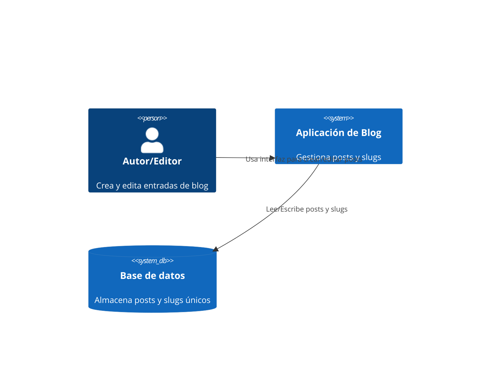

# Product Requirements Document for Gestión de Títulos y Slugs SEO-friendly

## Overview

**Producto:** Sistema de gestión de títulos y generación de slugs amigables para un blog.

**Descripción breve:** Este producto añade funcionalidades para crear, validar y gestionar títulos de artículos y generar slugs SEO-friendly automáticamente, con validaciones que cumplen recomendaciones de SEO (longitud de título y meta description) y reglas para slugs.

### Goals

- Automatizar la generación de slugs amigables y únicos a partir de los títulos.
- Validar títulos y descripciones según métricas SEO (longitud y formato) antes de la publicación.
- Permitir edición segura de slugs con gestión de redirecciones (301) cuando cambien.

## Stakeholders

- **Propietario del producto:** Equipo de contenidos / Product Manager.
- **Usuarios:** Autores y editores del blog.
- **Operaciones:** Equipo DevOps (deploys, redirecciones).
- **Desarrollo:** Equipo backend/frontend encargado de implementar y mantener la funcionalidad.

## Functional Requirements

1. Gestión de títulos
   - Crear/editar títulos para entradas de blog.
   - Validación en tiempo real de longitud del título.

2. Generación de slugs
   - Generación automática de slug a partir del título al crear una entrada.
   - Reglas: convertir a minúsculas, transliterar caracteres no-ASCII, reemplazar espacios por `-`, eliminar caracteres no permitidos, evitar guiones consecutivos, trim de guiones al inicio/fin.
   - Límite de longitud: slug recomendada máxima 100 caracteres; truncar limpiamente sin cortar palabras si es posible.

3. Edición y unicidad
   - Permitir editar el slug manualmente con las mismas validaciones.
   - Comprobar unicidad en la base de datos; en caso de colisión, proponer sufijo incremental `-2`, `-3`, etc.

4. Redirecciones y SEO
   - Si el slug cambia tras publicar, crear una redirección 301 desde la URL antigua a la nueva.
   - Registrar cambios de slug en un historial para auditoría.

5. Previsualización SEO
   - Mostrar vista previa del título y meta description tal como aparecería en SERPs.
   - Validaciones visuales: aviso si título > 60 caracteres o meta description > 160 caracteres.

6. API / Workflow
   - Endpoints mínimos:
     - `POST /api/posts` crear post (genera slug si no se proporciona).
     - `PUT /api/posts/{id}` actualizar post (gestionar cambio de slug y redirección si aplica).
     - `GET /api/posts/slug-available?slug=...` chequear disponibilidad.

## SEO Validation Rules (reglas concretas)

- Título: ideal 50–60 caracteres; máximo recomendado 60 caracteres. Mostrar advertencia si > 60.
- Meta description: ideal 150–160 caracteres; máximo recomendado 160 caracteres. Mostrar advertencia si > 160.
- Slug: solo minúsculas ASCII y `-`; máximo recomendado 100 caracteres; no caracteres de puntuación salvo `-`.
- Canonical: cada entrada debe tener una URL canónica consistente.

## Technical Requirements

### Technical Stack

- Backend: Java + Spring Boot (repositorio actual ya usa Spring Boot).
- Base de datos: PostgreSQL (u otra relacional), campo `slug` con índice único.
- Frontend: plantillas existentes o JavaScript para validación en tiempo real.
- Tests: pruebas unitarias e integradas para generación y colisiones de slugs.

### Data model (sugerido)

- `posts` table (relevantes):
  - `id` (PK)
  - `title` (string)
  - `slug` (string, unique, indexed)
  - `meta_description` (string)
  - `status` (draft|published)
  - `published_at` (datetime)

### Behaviour & APIs

- Generación de slug:
  - Normalizar string -> `slugify(title)` -> truncar -> comprobar unicidad -> persistir.
- Cambios de slug:
  - Al cambiar un slug de una entrada publicada, crear registro de redirección y emitir 301.
- Seguridad:
  - Sanitizar inputs y validar longitud en el backend además del cliente.

## Non-functional Requirements

- Rendimiento: generación de slug y comprobación de unicidad deben ser rápidas; la verificación de colisiones debe ser eficiente (consulta indexada).
- Disponibilidad: sistema debe soportar tráfico típico del blog; redirecciones deben responder con baja latencia.
- Internacionalización: transliteración robusta para títulos con acentos y caracteres no latinos.

## Compliance & Constraints

- Mantener compatibilidad con la infraestructura existente (Spring Boot).
- No almacenar datos sensibles en el slug.

## Acceptance Criteria

- Crear entrada con título genera slug válido automáticamente.
- Slug único en la base de datos; en caso de colisión, el sistema añade sufijo incremental.
- Usuario puede editar slug; si la entrada ya fue publicada, una redirección 301 es creada.
- Las validaciones SEO muestran advertencias para títulos >60 y meta description >160.

## System C4 Context diagram

## Deliverables

- `docs/PRD.md` (este documento).
- Especificación técnica para implementación (endpoints, pruebas).
- Conjunto de tests que cubran generación de slug, colisiones y redirecciones.

## Next Steps

1. Revisar con Product & Contenido las reglas SEO exactas (umbrales y mensajes).
2. Implementar `slugify` util en backend y pruebas unitarias.
3. Añadir validación y preview en la UI.
4. Implementar redirecciones 301 y migración de slugs antiguos si aplica.

---
Última actualización: 2025-11-18
